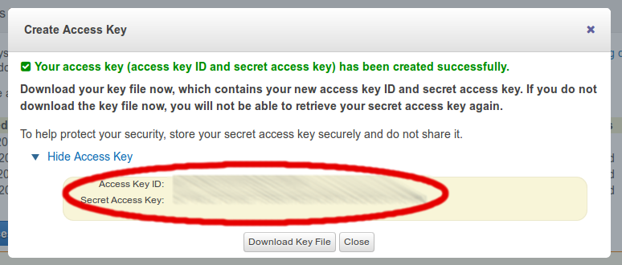
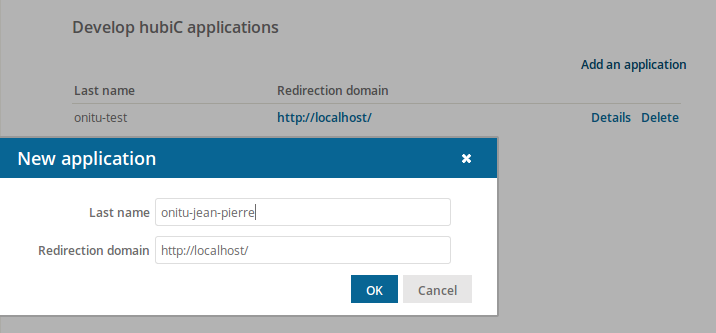
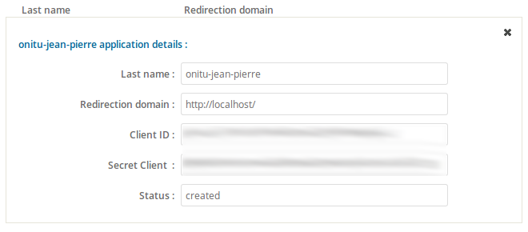
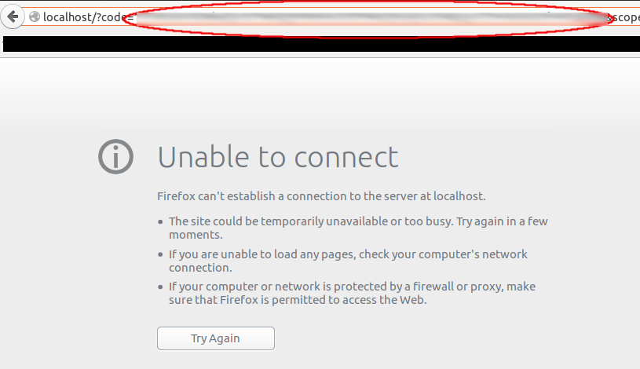
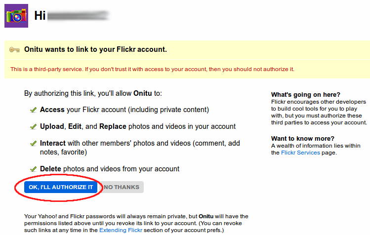

B1;3409;0c# Configuration

Une fois qu'Onitu et les *drivers* des services que vous désirez utiliser sont correctement installés avec PIP, il reste à configurer leur utilisation au sein du logiciel.

Pour ce faire, la configuration d'Onitu s'effectue par l'édition d'un fichier de configuration au format *JSON*.

Un exemple de configuration sera utilisé tout au long de ce chapitre, que vous pouvez retrouver en figure \ref{json_example}.

Dans ce chapitre, nous allons aborder, point par point, tout ce qu'il y a à savoir pour configurer *Onitu* et ses services.

## Le nom

Premièrement, chaque configuration *JSON* possède un attribut `name` déterminant son nom.

Ce nom est utilisé en interne pour permettre de lancer simultanément plusieurs configurations différentes. Assurez-vous donc que ce nom soit unique.

## Les services

La section `services` du document *JSON* vous permet de lister les services.

Un service est une instance de *driver*, et correspond au paramétrage d'un compte sur ce service. Chaque service est associée à une clef permettant de l'identifier, dans les règles par exemple.

Un service est composée :

* d'un nom permettant de l'identifier de manière unique : "dropbox-bob", "dropbox-alice"...
* d'un champ `driver` contenant le nom du *driver* à instancier, en général le même que celui du service supporté par ce *driver*, comme *dropbox* ou *google_drive*
* d'un champ `options` pour les options de lancement ce *driver*. Ces options sont spécifiques à chaque service, comme les données de connexion, et peuvent varier selon les *drivers*. Dans cette documentation, le symbole\Mandatory{} symbolise qu'il s'agit d'un champ obligatoire.

Dans notre exemple, nous utiliserons deux services: le premier pour interagir avec les fichiers locaux et le second connecté à un compte *Dropbox*.

\newpage

### Fichiers locaux

Ce driver est inclus dans l'installation de base d'*Onitu*. Il permet de transférer et synchroniser des fichiers avec votre système de fichiers local, sur votre disque dur.

Le nom à utiliser pour le *driver* des fichiers locaux est `local_storage`. Ce *driver* ne comporte qu'une option :

* \Mandatory{root} : le répertoire racine à partir duquel il opère.

**Attention**: le nom du répertoire racine est relatif à celui dans lequel est contenu *Onitu*.

Une configuration possible est la suivante:

\begin{figure}[h]
\begin{lstlisting}[language=json,firstnumber=1]
"Local": {
  "driver": "local_storage",
  "options": {
    "root": "example/local_driver"
  }
}
\end{lstlisting}
\end{figure}

\newpage

### Dropbox

Le nom du *driver* **Dropbox** est simplement `dropbox`. Il comporte quatre options :

* \Mandatory{root} : le dossier à l'intérieur duquel Onitu placera tous vos fichiers sur Dropbox
* \Mandatory{access\_key} : votre clé d'accès Dropbox
* \Mandatory{access\_secret} : votre clé secrète Dropbox
* **changes_timer** : la fréquence à laquelle Onitu vérifie les changements sur le compte Dropbox, en secondes. La valeur par défaut est **60 secondes**.

Pour obtenir vos clés d'accès, vous devrez vous servir du script d'authentification **get_access_token.py** fourni à l'installation du driver Dropbox. Vous devez au préalable être connecté-e sur Dropbox.

\newpage

Un exemple de configuration de service Dropbox réussie :

\begin{figure}[h]
\begin{lstlisting}[language=json,firstnumber=1]
"dropbox-bob": {
  "driver": "dropbox",
  "options": {
    "access_key": "MY_ACCESS_KEY"
    "access_secret": "MY_SECRET_KEY"
  }
}
\end{lstlisting}
\end{figure}

\newpage

### Amazon S3

Le nom du *driver* Amazon S3 est `amazon_s3`. Il vous permet de connecter un *bucket* Amazon S3 à Onitu.

**Attention**: Amazon S3 est un service **payant** au nombre de requêtes HTTP effectuées avec lui. L'utilisation d'Onitu ne déroge pas à cette règle, et c'est pourquoi **votre activité avec Amazon S3 au travers d'Onitu vous sera facturée par Amazon tout comme des transferts classiques**.

Le service du *driver* Amazon S3 comporte cinq options :

* \Mandatory{root} : le dossier à l'intérieur duquel Onitu placera tous vos fichiers sur Amazon S3
* \Mandatory{bucket} : le bucket Amazon S3 avec lequel Onitu doit se connecter
* \Mandatory{aws\_access\_key} : votre clé d'accès AWS
* \Mandatory{aws\_access\_secret} : votre clé secrète AWS
* **changes_timer** : la fréquence à laquelle Onitu vérifie les changements sur le bucket Amazon S3, en secondes. La valeur par défaut est **10 secondes**. **Cette action consomme 2 requêtes HTTP GET.**

Si vous ne possédez pas déjà vos clés d'accès Amazon S3, il faut vous connecter à votre compte Amazon et vous rendre à l'adresse \url{https://console.aws.amazon.com/iam/home?#security_credential}.

Pour créer une nouvelle paire de clés, cliquez sur "Create New Access Keys". L'opération devrait être instantanée et générer un ID de clé d'accès et une clé d'accès secrète. Ce sont les clés que vous devez utiliser avec Onitu.

\newpage

Un exemple de configuration d'entrée Amazon S3 réussie :

\begin{figure}[h]
\begin{lstlisting}[language=json,firstnumber=1]
"amazon-s3-alice": {
  "driver": "amazon_s3",
  "options": {
    "root": "onitu/",
    "bucket": "my-bucket",
    "aws_access_key": "MY_ACCESS_KEY",
    "aws_secret_key": "MY_SECRET_KEY",
    "changes_timer" : 300
  }
}
\end{lstlisting}
\end{figure}

\newpage

### HubiC

Le nom du *driver* pour le service HubiC d'OVH est `hubic`. Il vous permet de connecter votre compte HubiC à Onitu.

Le service du *driver* HubiC comporte cinq options :

* \Mandatory{root} : le dossier à l'intérieur duquel Onitu placera tous vos fichiers sur Hubic
* \Mandatory{refresh\_token} : votre clé pour accéder à Hubic depuis Onitu *(voir plus bas)*
* \Mandatory{client\_id} : l'identifiant de votre application Onitu pour Hubic *(voir plus bas)*
* \Mandatory{client\_secret} : la clé secrète de votre application Onitu pour Hubic *(voir plus bas)*
* **changes_timer** : la fréquence à laquelle Onitu vérifie les changements sur le compte Hubic, en secondes. La valeur par défaut est **60 secondes**.

Pour utiliser Onitu avec HubiC, il vous faut créer une application Onitu pour HubiC.

Une fois votre compte HubiC créé, commencez par vous rendre sur la page <https://hubic.com/home/browser/developers/>. Pour créer une nouvelle application, cliquez sur "*Add an application*". Assurez-vous de choisir un nom unique pour votre application. Entrez `http://localhost/` comme domaine de redirection.

Une fois votre application HubiC créée, vous devez récupérer son identifiant et sa clé secrète. Pour cela, cliquez sur "Details" dans l'interface, et copiez le contenu des champs "*Client ID*" et "*Secret Client*".

\newpage

Ouvrez ensuite le script **get_refresh_token.py** fourni avec l'installation du *driver* HubiC dans un éditeur de texte, et remplacez le contenu de `client_id` et `client_secret` avec les clés que vous avez récupérées sur l'interface HubiC.

Vous devrez ensuite lancer le script à l'aide de la commande `python get_refresh_token.py`. Après avoir appuyé sur Entrée, le script ouvrira une fenêtre dans votre navigateur Internet où vous devrez rentrer vos identifiants HubiC et cliquer sur le bouton "Accept" pour autoriser Onitu à accéder à votre compte HubiC.

\newpage

Vous arriverez ensuite sur une page vide, car vous n'avez aucune application Web hébergée sur votre ordinateur permettant de récupérer le code de vérification. Mais vous pouvez le récupérer depuis la barre d'adresse de votre navigateur, en copiant la valeur du paramètre `code`.

\newpage

Retournez dans le terminal pour coller le code ainsi copié. Le script produira alors un code d'autorisation, le *refresh token*, qui est celui que vous devrez utiliser pour configurer Onitu.

\newpage

Un exemple de configuration du service HubiC réussie :

\begin{figure}[h]
\begin{lstlisting}[language=json,firstnumber=1]
"hubic-jean-pierre": {
  "driver": "hubic",
  "options": {
    "root": "onitu/",
    "refresh_token": "MY_REFRESH_TOKEN",
    "client_id": "MY_CLIENT_ID",
    "client_secret": "MY_CLIENT_SECRET",
    "changes_timer" : 300
  }
}
\end{lstlisting}
\end{figure}

\newpage

### Flickr

Le nom du *driver* pour Flickr est `flickr`. Il vous permet de connecter votre compte Flickr à Onitu, et de synchroniser vos photos gérées par Onitu avec Flickr.

**Attention** : le *driver* Flickr est dit "à sens unique". En effet, en raison de limitations techniques, il n'est pas possible d'importer des photos depuis Flickr avec Onitu. Il vous sera uniquement possible d'envoyer des photos sur Flickr depuis d'autres services gérés par Onitu, mais l'inverse n'est pas vrai.

Le service du *driver* Flickr comporte quatre options:

* \Mandatory{root} : le dossier à l'intérieur duquel Onitu placera tous vos fichiers sur Flickr
* \Mandatory{oauth\_token} : votre jeton d'accès OAuth pour Flickr *(voir plus bas)*
* \Mandatory{oauth\_token\_secret} : votre clé secrète OAuth pour Flickr *(voir plus bas)*
* **changes_timer** : la fréquence à laquelle Onitu vérifie les changements sur le compte Flickr, en secondes. La valeur par défaut est **20 secondes**.

Pour utiliser Onitu avec Flickr, il vous faut lancer dans un terminal le script **get_tokens.py** fourni à l'installation du *driver* Flickr pour Onitu.

Vous aurez besoin de vous rendre à l'adresse indiquée dans votre navigateur Web pour autoriser Onitu à accéder à votre compte Flickr. Flickr vous redirigera ensuite sur un document XML contenant vos informations d'autorisation, dont vous devrez copier-coller l'adresse dans votre terminal pour finaliser la procédure du script.

La page Flickr vous redirige alors sur un document XML. Copiez la nouvelle URL de ce document, revenez dans votre terminal, et collez-la à l'emplacement prévu à cet effet par le script.

Le script vous procure alors les jetons OAuth que vous serez en mesure d'utiliser dans votre configuration Onitu.

\newpage

Un exemple de configuration du service Flickr réussie :

\begin{figure}[h]
\begin{lstlisting}[language=json,firstnumber=1]
"flickr-william": {
  "driver": "flickr",
  "options": {
    "root": "onitu/",
    "oauth_token": "MY_OAUTH_TOKEN",
    "oauth_secret_token": "MY_SECRET_TOKEN",
    "changes_timer" : 300
  }
}
\end{lstlisting}
\end{figure}

\newpage

## Les règles

Les règles vous permettent de définir quels fichiers doivent être synchronisés vers quels services, et s'insèrent dans la section `rules` du document.

Dans notre exemple, nous souhaitons que toutes les modifications (création, mise à jour ou suppression) de fichiers soient transférées au service «Local», mais que seules celles opérant sur des images du répertoire `photos/`, et de type *JPG* ou *PNG*, soient relayées à *Dropbox*, comme explicité sur les schémas ci-dessous:

Une règle consiste en un ensemble de deux éléments: la condition d'acceptation d'un fichier et l'ensemble des services cibles.

La condition liste les différents attributs du fichier que vous voulez tester. Les conditions actuellement disponibles sont :

- le chemin du fichier (`path`)
- une liste de types *MIME* (`mime`).

La condition s'entre en tant que dictionnaire associé à la clef `match`.

L'ensemble des cibles est une simple liste nommée `sync` des noms des services affectés par la règle.

Pour synchroniser les fichiers de n'importe quel service vers le disque dur, et envoyer toutes les images contenues dans le dossier "/photos/", les règles que nous utilisons pour notre exemple s'écrivent de la manière suivante:
\begin{figure}[h]
\begin{lstlisting}[language=json,firstnumber=1]
"rules": [
  {
    "match": {"path": "/"},
    "sync": ["Local"]
  },
  {
    "match": {"path": "/photos/", "mime": ["image/png", "image/jpeg"]},
    "sync": ["Dropbox"]
  }
]
\end{lstlisting}
\end{figure}

Par la suite seront aussi disponibles des conditions sur le nom du fichier ou sur sa taille.

\begin{figure}[p]
\begin{lstlisting}[language=json,firstnumber=1]
{
  "name": "setup_example",

  "entries": {
    "Local": {
      "driver": "local_storage",
      "options": {
        "root": "example/local_driver"
      }
    },
    "Dropbox": {
      "driver": "dropbox",
      "options": {
        "access_key": "MY_ACCESS_KEY",
        "access_secret": "MY_SECRET_KEY",
	"changes_timer": 300
      }
    }
  },

  "rules": [
    {
      "match": {"path": "/"},
      "sync": ["Local"]
    },
    {
      "match": {"path": "/photos/", "mime": ["image/png", "image/jpeg"]},
      "sync": ["Dropbox"]
    }
  ]

}
\end{lstlisting}
\caption{Fichier \emph{setup.json} d'exemple}
\label{json_example}
\end{figure}
