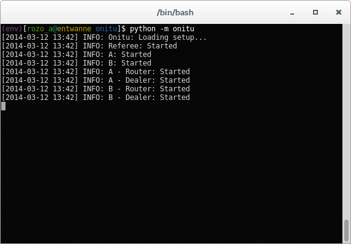

# Installation

L'installation repose sur *PIP*, un gestionnaire de paquets Python très répandu et multi-plateforme, s'utilisant en ligne de commande.

*PIP* se charge de la récupération des sources ainsi que de la résolution des dépendances.

Un installateur graphique sera fourni par la suite afin d'en simplifier l'installation sous Windows.

## Installer Onitu

Une fois PIP installé, pour installer Onitu, lancez la commande suivante dans un terminal:

* `pip install onitu`

## Installer des *drivers* Onitu

La force d'Onitu est de proposer un système découplé de *drivers*, les logiciels communiquant avec les services de stockage de votre choix.

Chaque *driver* possède donc son propre paquet PIP afin de n'installer que ce dont vous avez besoin. Le nom du paquet d'un *driver* Onitu suivra toujours la forme `onitu-nom_du_driver`.

Pour installer un *driver* Onitu, lancez la commande suivante dans un terminal, en remplaçant par le nom approprié, par exemple `onitu-dropbox` ou `onitu-google-drive`:

* `pip install onitu-nom_du_driver`

Voici la liste des *drivers* Onitu actuellement installables par PIP :

* Dropbox : *onitu-dropbox*
* Google Drive : *onitu-google-drive*
* Amazon S3 : *onitu-s3*
* Hubic : *onitu-hubic*
* Flickr : *onitu-flickr*
* Evernote : *onitu-evernote*

## Lancement

Une fois installé, vous pouvez lancer *Onitu* par la simple commande `onitu`, à laquelle vous pouvez joindre le chemin d'un fichier de configuration à l'aide de l'option `--setup` (par défaut est utilisé le fichier `.onitu/setup.json` de votre répertoire utilisateur).

Cela vous permet par exemple de lancer plusieurs instances indépendantes d'*Onitu*, opérant chacune sur une configuration différente, avec des services différents.

D'autres options sont disponibles au lancement d'*Onitu*:

* Vous pouvez sélectionner la *socket* *ZMQ* à utiliser pour la journalisation grâce à l'option `--log-uri`.
* Vous pouvez obtenir un affichage plus complet (dit de *debug*) à l'aide de l'option `--debug`.
* Enfin, l'option `--help` vous affiche la présente liste d'options disponibles.

\newpage

## Désinstallation

Si vous êtes amené à désinstaller *Onitu*, il vous suffit de lancer dans un terminal la commande suivante :

* `pip uninstall onitu`

Cette commande supprimera *Onitu* ainsi que l'ensemble de ses pilotes complémentaires (*drivers*), sans oublier les fichiers de configuration locaux qui lui sont propres.
