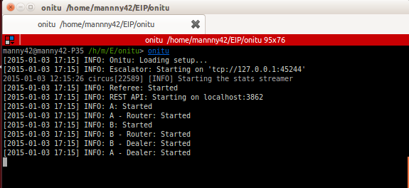

# Installation

## Installer Python

Onitu est un logiciel entièrement développé en Python. C'est pourquoi pour utiliser Onitu, vous devez disposer d'un interpréteur de langage Python.

La plupart des systèmes modernes sont délivrés avec l'interpréteur Python installé par défaut. Vous n'avez donc normalement pas à vous occuper de son installation.

Toutefois, si vous vous trouvez en présence d'un système d'exploitation ne disposant pas de Python, vous devrez installer l'interpréteur depuis le site officiel de Python à cette adresse : <https://www.python.org/download>.

Nous faisons de notre mieux pour garder Onitu compatible avec les versions majeures de Python, c'est pourquoi Onitu est compatible avec **Python 2.7, 3 et supérieures**.

## Installer PIP

*Onitu* repose sur *PIP*, un gestionnaire de paquets Python très répandu et multi-plateforme, s'utilisant en ligne de commande. *PIP* se charge de l'installation des programmes ainsi que de la résolution de leurs dépendances.

**Note : si vous possédez Python version 3.4 ou supérieure, PIP vient préinstallé dans votre distribution Python.** Pour vous assurer de la version de Python, tapez la commande `python -V` dans votre terminal.

Si votre installation de Python ne comprend pas PIP, la procédure générique est de télécharger le script officiel d'installation à l'adresse suivante : <https://bootstrap.pypa.io/get-pip.py>, puis le lancer dans un terminal avec la commande `python get-pip.py`, opération pouvant nécessiter les droits administrateur. Cette procédure est valable sur **Linux, Windows et Mac OS X**. Certains systèmes, comme les distributions Linux, peuvent proposer des procédures d'installation alternatives, par le biais de leurs gestionnaires de paquets par exemple. 

Pour plus d'informations à propos de l'installation de PIP, veuillez vous référer à sa documentation officielle (en anglais) : <http://pip.readthedocs.org/en/latest/installing.html>.

## Installer Onitu

Une fois PIP installé, pour installer Onitu, lancez la commande suivante dans un terminal:

* `pip install onitu`

Pour l'installer uniquement pour votre utilisateur (ne requiert pas les droits administrateur) :

* `pip install --user onitu`

Un installateur graphique sera fourni par la suite afin d'en simplifier l'installation sous Windows.

## Installer des *drivers* Onitu

La force d'Onitu est de proposer un système découplé de *drivers*, les logiciels communiquant avec les services de stockage de votre choix.

Chaque *driver* possède donc son propre paquet PIP afin de n'installer que ce dont vous avez besoin. Le nom du paquet d'un *driver* Onitu suivra toujours la forme `onitu-nom_du_driver`.

Pour installer un *driver* Onitu, lancez la commande suivante dans un terminal, en remplaçant par le nom approprié, par exemple `onitu-dropbox` ou `onitu-google-drive`:

* `pip install onitu-nom_du_driver`

Voici la liste des *drivers* Onitu actuellement installables par PIP :

* Dropbox : *onitu-dropbox*
* Google Drive : *onitu-google-drive*
* Amazon S3 : *onitu-s3*
* Hubic : *onitu-hubic*
* Flickr : *onitu-flickr*
* Evernote : *onitu-evernote*

## Lancement

Une fois installé, vous pouvez lancer *Onitu* par la simple commande `onitu`, à laquelle vous pouvez joindre le chemin d'un fichier de configuration à l'aide de l'option `--setup` (par défaut est utilisé le fichier `.onitu/setup.json` de votre répertoire utilisateur).

Cela vous permet par exemple de lancer plusieurs instances indépendantes d'*Onitu*, opérant chacune sur une configuration différente, avec des services différents.

D'autres options sont disponibles au lancement d'*Onitu*:

* Vous pouvez sélectionner la *socket* *ZMQ* à utiliser pour la journalisation grâce à l'option `--log-uri`.
* Vous pouvez obtenir un affichage plus complet (dit de *debug*) à l'aide de l'option `--debug`.
* Enfin, l'option `--help` vous affiche la présente liste d'options disponibles.

\newpage

## Désinstallation

Si vous êtes amené à désinstaller *Onitu*, il vous suffit de lancer dans un terminal la commande suivante :

* `pip uninstall onitu`

Cette commande supprimera *Onitu*.

Cette démarche est reproductible avec n'importe lequel des *drivers* Onitu si vous souhaitez en désinstaller un.
